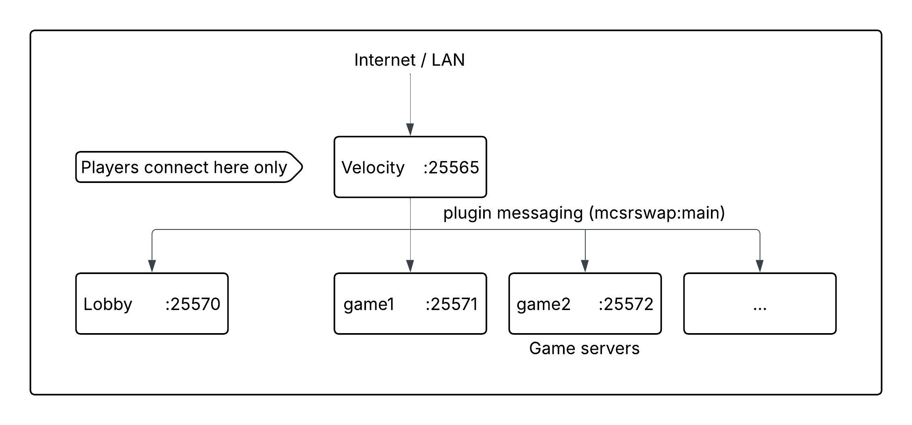

# MCSR-Swap
MCSR-Swap is a Minecraft speedrun gamemode where players rotate between game servers on a timer. The goal is for the team to complete a configurable percentage of worlds by reaching and exiting the End portal.
You can play as one team or one team versus another team. The project consists of two files:

| File | Where it goes |
|---|---|
| `mcsrswap-fabric-mod-1.0.3.jar` | `mods/` folder of every game server |
| `mcsrswap-velocity-plugin-1.0.3.jar` | `plugins/` folder of the Velocity proxy |

---

## 🚀 Quick Start Options

### Option 1: Classic Setup (Manual Configuration)
**Recommended for:** Full control, any platform (Windows/Linux/Mac)

Follow the setup instructions below. You manually configure all game servers.

### Option 2: Docker Dynamic Setup
**Recommended for:** Easy deployment, automatic server management

See **[README-DOCKER.md](README-DOCKER.md)** for a simplified Docker-based setup where game servers are spawned automatically on `/ms start`.

---

## Requirements

| Component | Version |
|---|---|
| Velocity proxy | 3.x (tested with 3.5.0-SNAPSHOT) |
| Game servers | Minecraft **1.16.1**, **Fabric** server |
| Fabric Loader | ≥ 0.12.0 |
| Fabric API | 0.18.0+build.387-1.16.1 (must match 1.16.1) |
| Java | 17 or newer |

### Required mods on every game server

These must be present in `mods/` alongside `mcsrswap-fabric-mod-1.0.3.jar`:

- [`fabric-api-0.18.0+build.387-1.16.1.jar`](https://modrinth.com/mod/fabric-api/version/0.18.0+build.387-1.16.1)
- FabricProxy 1.3.4 – enables Velocity modern forwarding for 1.16.1.  
  Download from GitHub: [OKTW-Network/FabricProxy → v1.3.4](https://github.com/OKTW-Network/FabricProxy/releases/tag/v1.3.4)

Recommended mods (optional but advised):

- Lithium – server-side optimisations, significant performance improvement
- Krypton – network stack optimisation, reduces bandwidth and tick overhead
- Starlight – rewrites the light engine, greatly speeds up chunk loading
- LazyDFU – skips unnecessary DataFixerUpper initialisation on startup
- Voyager – fixes a rare ConcurrentModificationException (CME) when running Java 11 or above (affects 1.14+)
- antigone – fixes a rare 1.16.1 server deadlock caused by a strider spawning during chunk generation with a zombified piglin baby chicken jockey as a passenger, creating a chunk-generation dependency loop

> Many of these mods only exist as backports or are maintained specifically for the speedrunning community. **[mods.tildejustin.dev](https://mods.tildejustin.dev/)** is the canonical source for 1.16.1 speedrunning mods.

---

## Network Layout



Players **only ever connect to the Velocity port**. All game server ports must be firewalled from the outside (only accessible from localhost / the machine running Velocity).

---

## Step 1 – Velocity setup

### 1.1 Install the plugin

Copy `mcsrswap-velocity-plugin-1.0.3.jar` into `plugins/`.

### 1.2 Configure `velocity.toml`

```toml
# Players connect here
bind = "0.0.0.0:25565"

online-mode = true
player-info-forwarding-mode = "modern"
forwarding-secret-file = "forwarding.secret"

[servers]
lobby = "127.0.0.1:25570"
game1 = "127.0.0.1:25571"
game2 = "127.0.0.1:25572"
# Add more game servers here – name them game3, game4, etc.
# The prefix "game" and lobby name "lobby" can be changed in plugins/mcsrswap/config.yml on your Velocity server.

try = ["lobby"]
```

> **Important:** Server names must match `gameServerPrefix` (default: `game`) and `lobbyServerName` (default: `lobby`) in the MCSR-Swap config.

### 1.3 Generate forwarding secret

Velocity generates `forwarding.secret` automatically on first run. Note the value – you will need it for each game server.

### 1.4 MCSR-Swap plugin config

On first start, Velocity creates:

```
plugins/mcsrswap/config.yml
plugins/mcsrswap/languages/en_us.yml
plugins/mcsrswap/languages/de_de.yml
```

**`config.yml`:**

```yaml
rotationTime: 120          # Seconds per rotation
requiredPercentage: 1.0    # Fraction of worlds that must be beaten to win (1.0 = all)
versus: false              # Versus mode: two teams compete against each other
language: en_us.yml        # Language file to use for player-facing messages
gameServerPrefix: game     # Velocity server names starting with this prefix are treated as game servers
lobbyServerName: lobby     # Exact Velocity server name used as the lobby
spectateAfterWin: false    # After finishing a world, spectate an adjacent server until the next rotation
spectateTarget: next       # Which adjacent server to spectate: "next" or "prev"
spectateMinTime: 15        # Only activate spectate if at least this many seconds remain in the rotation
saveHotbar: true           # On player swap, rearrange the server's hotbar items to match the joining player's own preferred hotbar layout
eyeHoverTicks: 80          # Total Eye of Ender lifetime in ticks (vanilla: 80 ≈ 2 s hover phase)
```

> **Why increase `eyeHoverTicks`?**  
> On a multiplayer server you cannot pause the game to freeze the Eye of Ender (pause-buffering), which is a common singleplayer technique for [NinjabrainBot](https://github.com/Ninjabrain1/Ninjabrain-Bot) readings. Increasing the hover duration gives players more time to read the values before the eye drops. This value is pushed to all game servers at game start.

#### Custom language files

Add any `.yml` file to `plugins/mcsrswap/languages/`. Set which file to use via the `language` key in `config.yml` (e.g. `language: de_de.yml`). This applies to all players – the Velocity plugin has no way to detect individual client languages. The setting takes effect on the next server start.

---

## Step 2 – Game server setup

Do the following for **each** game server (game1, game2, …).

### 2.1 server.properties

```properties
server-port=25571          # Use 25571 for game1, 25572 for game2, etc.
online-mode=false          # Must be false – authentication is handled by Velocity
spawn-protection=0         # Players must be able to break blocks everywhere; set this to 0
```

### 2.2 Enable Velocity modern forwarding (FabricProxy)

**FabricProxy 1.3.4** is required (see section *Required mods* above).

The config file is generated on first server start. You then need to set these values in `config/FabricProxy.toml`:

```toml
BungeeCord = false
Velocity = true
secret = "PASTE_YOUR_FORWARDING_SECRET_HERE"
```

Replace the secret with the value from Velocity's `forwarding.secret` file.

### 2.3 Install mods

Place the following in `mods/`:

```
mcsrswap-fabric-mod-1.0.3.jar
fabric-api-0.18.0+build.387-1.16.1.jar
FabricProxy-1.3.4.jar
```

The mod has no configuration file of its own. All settings are configured centrally in the Velocity `plugins/mcsrswap/config.yml` and pushed to the game servers at game start.

---

## Step 3 – Lobby server setup

Use a **Fabric** or **Paper/Purpur** server on port 25570. Plain Vanilla is not recommended as it lacks velocity modern forwarding mode support. Players land here when they connect and between games.

`server.properties`:

```properties
server-port=25570
online-mode=false
```

For a Fabric lobby, install FabricProxy 1.3.4 (same as game servers) to get correct player UUIDs.  
For a Paper/Purpur lobby, enable Velocity modern forwarding in `paper.yml`:

```yaml
settings:
  velocity-support:
    enabled: true
    online-mode: true
    secret: "PASTE_YOUR_FORWARDING_SECRET_HERE"
```

---

## Commands

All commands run through the Velocity proxy. Prefix: `/ms`

### Admin commands (requires `swap.admin` permission)

| Command | Description |
|---|---|
| `/ms start` | Start the game (reuses existing Docker containers if present) |
| `/ms start --clean` | Start the game after removing old Docker containers and volumes |
| `/ms stop` | End the game and send everyone to the lobby |
| `/ms forceswap` | Immediately rotate all players to the next server |
| `/ms setrotation <seconds>` | Change the rotation interval (minimum 10 s) |
| `/ms spectate <player>` | Toggle spectator mode for a player |
| `/ms setteam <a\|b\|none> <player> [player2…]` | Assign players to a team (versus mode) |
| `/ms setteamname <a\|b> <name>` | Set the display name of a team |
| `/ms setversus <true\|false>` | Enable or disable versus mode |
| `/ms state` | Show the current game state |

> **Docker mode** adds `/ms start --clean` (cleanup before start) and `/ms cleanup` (remove containers + volumes). See [README-DOCKER.md](README-DOCKER.md).

### Player commands

| Command | Description |
|---|---|
| `/ms jointeam <a\|b>` | Join a team before the game starts |

### Permissions

Admin commands require the `swap.admin` permission.

- **Console** always has full access
- **Players** need the `swap.admin` permission granted via a Velocity permissions plugin (e.g. [LuckPerms for Velocity](https://luckperms.net/))

Without a permissions plugin, only the server console can run admin commands. This means you can start/stop the game via the Velocity console without installing LuckPerms.

---

## Versus mode

When `versus: true` or `/ms setversus true` is used:

- Game servers are split in half: the first half goes to Team A, the second half to Team B (e.g. with 4 servers: Team A → game1, game2 · Team B → game3, game4)
- Each team's progress is tracked separately
- The team that beats the required percentage of their worlds first wins
- Players can pre-assign themselves with `/ms jointeam` or be randomly assigned at game start (balanced distribution)

---

## Playing over the Internet

Only the **Velocity port (default 25565)** needs to be reachable. All game server ports stay local.

### Option A – Router port forwarding

1. Find your router's admin panel (usually `192.168.1.1` or `192.168.0.1`)
2. Forward a **TCP port** to the local IP of the machine running Velocity  
3. Find your public IP at [whatismyip.com](https://www.whatismyip.com) and share it with your friends (as `<ip>:<port>`)
4. **Security note:** Only open the one port you chose. Keep game server ports (25570–25574) closed to the internet.

> **Tip:** Avoid using the default Minecraft port 25565 on your router. Automated bots constantly scan the internet for open port 25565 and will try to connect. Using a different external port (e.g. 25999 → internal 25565) keeps your server quieter. Players just need to add the port to the address: `yourip:25999`.

### Option B – playit.gg (recommended, no router access needed)

[playit.gg](https://playit.gg) creates a stable public tunnel to your server without opening router ports.

1. Download the [playit agent](https://playit.gg/download) for your OS
2. Run it and follow the setup wizard to create a **Minecraft Java** tunnel on port 25565
3. Share the provided `something.mc.gg` address with your friends
4. No router configuration needed

### Option C – VPN (e.g. ZeroTier / Tailscale)

For small groups who all install a VPN client:

- [Tailscale](https://tailscale.com) – easiest, works through NAT automatically
- [ZeroTier](https://www.zerotier.com) – more control, slightly more setup

All players join the same virtual network and connect using the host's Tailscale/ZeroTier IP.

### Security recommendations

- Keep your game server ports firewalled (they should only accept connections from `127.0.0.1`)
- Use Velocity's `online-mode = true` so only authenticated Mojang accounts can join
- Consider a whitelist (`whitelist.json`) on the Velocity proxy for private sessions

